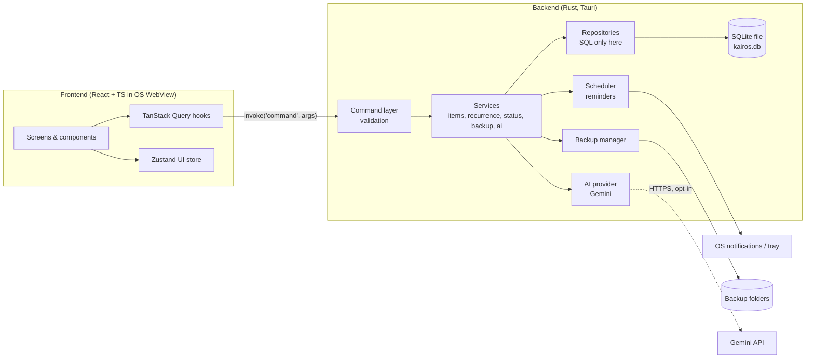

# Kairos — Architecture

## 1. High-level overview



- The **frontend** is purely presentation + interaction. It never runs SQL and never calls the internet.
- The **Rust backend** owns data, time, files, notifications, and network.
- Communication is through typed **Tauri commands** (request/response) and **events** (backend → frontend pushes, e.g., `items:changed`, `reminder:fired`).

## 2. Repository layout

```
kairos/
├─ CLAUDE.md                 # copy of PROJECT_RULES.md
├─ docs/                     # this document set
├─ src/                      # frontend
│  ├─ app/                   # router, providers, layout shell
│  ├─ features/
│  │  ├─ dashboard/
│  │  ├─ calendar/           # day, week, month, agenda views
│  │  ├─ items/              # item editor, item card, checklist
│  │  ├─ capture/            # quick capture, NL parser
│  │  ├─ inbox/
│  │  ├─ habits/  goals/  templates/  focus/  review/
│  │  ├─ search/             # command palette
│  │  ├─ settings/  onboarding/  backup/
│  │  └─ ai/
│  ├─ components/ui/         # shadcn/ui primitives (restyled)
│  ├─ lib/
│  │  ├─ api/                # typed wrappers around invoke()
│  │  ├─ dates/  nlp/  recurrence/
│  │  └─ utils.ts
│  ├─ styles/                # tokens.css, globals.css, fonts
│  ├─ i18n/locales/en.json
│  └─ types/                 # generated from Rust (ts-rs / specta)
├─ src-tauri/
│  ├─ src/
│  │  ├─ main.rs  lib.rs
│  │  ├─ commands/           # thin: validate → call service
│  │  ├─ services/           # business logic
│  │  ├─ repo/               # SQL queries
│  │  ├─ db/  (pool.rs, migrations/)
│  │  ├─ scheduler/          # reminder engine
│  │  ├─ backup/
│  │  ├─ ai/                 # AiProvider trait + gemini.rs
│  │  └─ error.rs
│  ├─ capabilities/          # Tauri permission files
│  └─ tauri.conf.json
└─ tests/e2e/
```

## 3. Type sharing
Rust structs are the source of truth. TypeScript types are generated with **`ts-rs`** into `src/types/` (decision 2026-10-07: tauri-specta for Tauri 2 is still a release candidate). Structs use `#[cfg_attr(test, derive(ts_rs::TS), ts(export))]` and `#[serde(rename_all = "camelCase")]`; integers crossing the boundary are `i32` (never `bigint`). Run `pnpm test:rust` to regenerate; CI fails if `src/types/` is out of date. Command wrappers are written by hand in `src/lib/api/` and tested against the command names. Frontend validates user input with Zod before sending; backend validates again.

## 4. Data model (SQLite)

Conventions: IDs are **UUID v7** text (time-sortable, sync-friendly). Timestamps are **UTC ISO-8601** text; all-day dates are `YYYY-MM-DD` text; the user's timezone is stored in settings and applied in the UI. Every table has `created_at`, `updated_at`, and `deleted_at` (soft delete → Trash).

```sql
CREATE TABLE areas (
  id TEXT PRIMARY KEY,
  name TEXT NOT NULL,
  color TEXT NOT NULL,          -- token key, e.g. 'area.work'
  icon TEXT NOT NULL,           -- lucide icon name
  sort_order INTEGER NOT NULL,
  is_archived INTEGER NOT NULL DEFAULT 0,
  created_at TEXT NOT NULL, updated_at TEXT NOT NULL, deleted_at TEXT
);

CREATE TABLE items (
  id TEXT PRIMARY KEY,
  kind TEXT NOT NULL CHECK (kind IN ('task','event')),
  title TEXT NOT NULL,
  notes TEXT,                    -- markdown
  area_id TEXT REFERENCES areas(id),
  priority INTEGER NOT NULL DEFAULT 0,   -- 0 none,1 low,2 med,3 high
  all_day INTEGER NOT NULL DEFAULT 0,
  start_at TEXT,                 -- UTC datetime, or NULL
  end_at TEXT,
  due_date TEXT,                 -- for date-only tasks
  completed_at TEXT,
  skipped_at TEXT,
  location TEXT,
  rrule TEXT,                    -- RFC 5545 recurrence rule
  recurrence_parent_id TEXT REFERENCES items(id),
  original_start_at TEXT,        -- for edited occurrences
  milestone_id TEXT REFERENCES milestones(id),
  reschedule_count INTEGER NOT NULL DEFAULT 0,
  source TEXT NOT NULL DEFAULT 'manual', -- manual|quick|nlp|ai_image|template|import
  created_at TEXT NOT NULL, updated_at TEXT NOT NULL, deleted_at TEXT
);
CREATE INDEX idx_items_start ON items(start_at);
CREATE INDEX idx_items_due ON items(due_date);
CREATE INDEX idx_items_area ON items(area_id);

CREATE TABLE checklist_items (
  id TEXT PRIMARY KEY, item_id TEXT NOT NULL REFERENCES items(id),
  text TEXT NOT NULL, done INTEGER NOT NULL DEFAULT 0, sort_order INTEGER NOT NULL,
  created_at TEXT NOT NULL, updated_at TEXT NOT NULL, deleted_at TEXT
);

CREATE TABLE reminders (
  id TEXT PRIMARY KEY, item_id TEXT NOT NULL REFERENCES items(id),
  offset_minutes INTEGER NOT NULL,      -- minutes before start/due (0 = at time)
  fire_at TEXT,                          -- computed next fire time (UTC)
  fired_at TEXT, snoozed_until TEXT,
  created_at TEXT NOT NULL, updated_at TEXT NOT NULL, deleted_at TEXT
);
CREATE INDEX idx_reminders_fire ON reminders(fire_at);

CREATE TABLE attachments (
  id TEXT PRIMARY KEY, item_id TEXT NOT NULL REFERENCES items(id),
  file_name TEXT NOT NULL, mime TEXT NOT NULL, size_bytes INTEGER NOT NULL,
  rel_path TEXT NOT NULL,     -- inside app-data/attachments/
  created_at TEXT NOT NULL, updated_at TEXT NOT NULL, deleted_at TEXT
);

CREATE TABLE inbox_entries (
  id TEXT PRIMARY KEY, kind TEXT NOT NULL CHECK (kind IN ('text','image','voice')),
  text TEXT, attachment_id TEXT REFERENCES attachments(id),
  processed_item_id TEXT REFERENCES items(id),
  created_at TEXT NOT NULL, updated_at TEXT NOT NULL, deleted_at TEXT
);

CREATE TABLE goals (
  id TEXT PRIMARY KEY, title TEXT NOT NULL, description TEXT,
  area_id TEXT REFERENCES areas(id), target_date TEXT, achieved_at TEXT,
  created_at TEXT NOT NULL, updated_at TEXT NOT NULL, deleted_at TEXT
);
CREATE TABLE milestones (
  id TEXT PRIMARY KEY, goal_id TEXT NOT NULL REFERENCES goals(id),
  title TEXT NOT NULL, target_date TEXT, sort_order INTEGER NOT NULL,
  created_at TEXT NOT NULL, updated_at TEXT NOT NULL, deleted_at TEXT
);

CREATE TABLE habits (
  id TEXT PRIMARY KEY, title TEXT NOT NULL, area_id TEXT REFERENCES areas(id),
  frequency TEXT NOT NULL,      -- 'daily' | 'weekly:3' | rrule
  reminder_time TEXT,           -- local HH:MM
  created_at TEXT NOT NULL, updated_at TEXT NOT NULL, deleted_at TEXT
);
CREATE TABLE habit_logs (
  id TEXT PRIMARY KEY, habit_id TEXT NOT NULL REFERENCES habits(id),
  log_date TEXT NOT NULL, created_at TEXT NOT NULL,
  UNIQUE(habit_id, log_date)
);

CREATE TABLE templates (
  id TEXT PRIMARY KEY, name TEXT NOT NULL,
  payload TEXT NOT NULL,        -- JSON: items with relative day/time offsets
  created_at TEXT NOT NULL, updated_at TEXT NOT NULL, deleted_at TEXT
);

CREATE TABLE focus_sessions (
  id TEXT PRIMARY KEY, item_id TEXT REFERENCES items(id),
  started_at TEXT NOT NULL, ended_at TEXT, planned_minutes INTEGER NOT NULL,
  created_at TEXT NOT NULL
);

CREATE TABLE feedback (
  id TEXT PRIMARY KEY, kind TEXT NOT NULL,   -- idea|frustration|bug
  text TEXT NOT NULL, context TEXT, status TEXT NOT NULL DEFAULT 'open',
  created_at TEXT NOT NULL, updated_at TEXT NOT NULL
);

CREATE TABLE settings (key TEXT PRIMARY KEY, value TEXT NOT NULL); -- JSON values
CREATE TABLE backup_log (
  id TEXT PRIMARY KEY, path TEXT NOT NULL, kind TEXT NOT NULL,  -- auto|manual|pre_restore
  size_bytes INTEGER, item_count INTEGER, ok INTEGER NOT NULL, error TEXT, created_at TEXT NOT NULL
);

-- Full-text search
CREATE VIRTUAL TABLE items_fts USING fts5(title, notes, content='items', content_rowid='rowid');
```

**Recurrence:** a recurring item is stored once with an `rrule`. Occurrences are **expanded on read** for the visible date range. Completing/editing a single occurrence creates an exception row (`recurrence_parent_id` + `original_start_at`).

**Status** is **computed**, not stored (see PRD §6), so it is always correct as time passes.

## 5. Storage locations
- Database: `{appDataDir}/kairos.db` (WAL mode, `foreign_keys=ON`, `synchronous=NORMAL`)
- Attachments: `{appDataDir}/attachments/{yyyy}/{mm}/{uuid}.{ext}`
- Backups: `{appDataDir}/backups/` + optional user folder
- Damaged database files (startup recovery): `{appDataDir}/damaged/`
- Logs: `{appLogDir}/kairos.log` (rotated, no personal content)

## 6. Key flows

### 6.1 Startup
1. Open DB → `PRAGMA integrity_check` (quick_check). If it fails → restore latest good backup automatically, show a calm notice.
2. Run pending migrations (back up first if any are pending).
3. Start scheduler; register global shortcut; create tray.
4. Frontend loads Dashboard query → render within 2 s.

### 6.2 Reminder scheduler (Rust)
- Single async loop: find the next `fire_at` across reminders, sleep until then (max 60 s, to survive sleep/clock changes), fire due notifications, compute next `fire_at` (recurrence aware).
- On system wake / time change → recompute.
- Missed reminders while the computer was off: show one combined notification ("While you were away: 3 reminders").

**As built (P2-T01–T04):**
- `reminders.offset_minutes` is measured back from the item's moment: the start time of a timed item, or the default reminder time (Settings, 09:00) on a date-only item's day. Whole-day offsets keep the local clock time across DST; others are exact durations. Pure maths in `scheduler/timing.rs` (DST-tested with a hand-built time zone).
- New items get one reminder at the moment (`[0]`) unless the editor sends a list; `ItemInput.reminders` omitted on update keeps them. Changing an item's date/time recomputes its reminders and clears snoozes; a reminder whose time has already passed is marked fired (moving a task to earlier today never sets one off).
- The loop (`scheduler/runner.rs`) wakes at the next `fire_at`, at most every 30 s. It marks due reminders fired in one transaction (each fires once), shows on-time ones individually, and combines several more than 10 minutes late into "While you were away". A local UTC-offset change, or a new default reminder time, recomputes reminders that haven't fired yet.
- Notifications (`notify.rs`): Windows toasts with Done / Snooze 10 min / 1 hour / Tomorrow; clicking opens the item (`app:open-item` event) or My Day (`app:navigate`). Snooze and Done run in Rust, so there are no snooze/dismiss commands yet. Notification and tray text comes from `src/i18n/locales/en.json` (compiled in). E2E runs never show real notifications.
- Daily summary: once per local day, from the chosen time until 4 hours later (a laptop opened at 10:30 still gets the 08:00 summary).
- Tray (`tray.rs`): Open, Quick add, today's next item (opens it), Quit. Closing the main window hides it to the tray (a one-time hint explains). Launch at login (default on) starts with `--hidden`.

### 6.2a Repeating items (P2-T06)
- A **series** is one `items` row with `rrule` (RFC 5545 RRULE without DTSTART; its own date or start time is the first occurrence). Series rows never appear in lists themselves; repo queries exclude `rrule IS NOT NULL`.
- **Occurrences are computed** (`scheduler/recurrence.rs`, `services/series.rs`) in local wall-clock time, so "every Monday 9:00" stays 9:00 across DST. Each has a key (`YYYY-MM-DD` or local `YYYY-MM-DDTHH:MM`) and the id `seriesId@key`.
- Acting on one occurrence (done, skip, move, edit "only this one", delete "only this one") first **stores it as an exception** row: `recurrence_parent_id` = series, `original_start_at` = key, a copy of the series' fields and reminders. A stored key hides the computed one. Every item command accepts `series@key` ids.
- **"This and following"** (`update_item`/`delete_item` with `scope: "following"`): from the first occurrence it changes or deletes the whole series; otherwise the series gets `UNTIL` just before the occurrence and (for edits) a new series starts there, taking over the later stored occurrences. When timing changes, unfinished stored occurrences are dropped (soft-deleted); finished ones stay as history.
- Steps (checklist) belong to the series and are shared by its occurrences.
- **Slipping (decisions 2026-10-09):** only the most recent past occurrence of a repeating task counts as missed (and only if after the series was created); earlier days' computed occurrences show as *past*. `get_dashboard` returns it in `overdue`; the frontend puts computed occurrences there into the **"Routines you missed"** card instead of Slipped, and they are not counted as slipped in the summary. "This week" lists only each series' next occurrence.
- Reminders sit on the series and always point at its next not-yet-handled occurrence; after firing they move on.
- Deleting a whole series soft-deletes its stored occurrences with the same timestamp; restoring the series restores them. The Trash lists the series once.

### 6.3 Backups
- Use SQLite **Online Backup API** (safe while running) through a **separate read-only connection**, so the app's connection is never blocked → write `kairos-<label>-YYYYMMDD-HHMMSS.mmm.db` (UTC). Labels: `auto`, `manual`, `pre-restore`, `pre-migration`, `pre-purge`. Attachments folder copy: added with attachments (P2-T11).
- When: every 24 h (background check every 30 min) and on every app close; "Back up now"; automatically before a migration, a restore, or a Trash purge.
- Retention: automatic → newest per day for the last 14 backup days, then newest per ISO week for 8 more weeks; safety copies (`pre-*`) → newest 10 of each; manual backups are never removed. Applied to the app folder and the extra folder.
- Verify each backup by opening it read-only (`PRAGMA quick_check` + item count); record successes and failures in `backup_log` (failures are shown in Settings › Backups).
- Optional extra folder (settings key `backup.folder`): every backup is copied there; its backups are listed and restorable too.
- Restore: validate the file name (no paths) → verify the backup → back up current data (`pre-restore`) → copy the backup into the live connection with the Online Backup API → run migrations → emit `data:reloaded` (every window refetches everything).

### 6.3a Startup integrity & recovery (P1-T15)
`PRAGMA quick_check` on the database file before opening. If it fails (or the file can't be read): move the file and its `-wal`/`-shm` into `{appDataDir}/damaged/` (never deleted) → copy in the newest backup that passes verification → show a one-time calm notice (`take_startup_notice`). With no good backup, Kairos starts with a fresh database and the notice says where the damaged file was kept. Trash items older than 30 days are purged at startup (backed up first).

### 6.4 Quick Capture
Global shortcut → small always-on-top Tauri window → user types → frontend parses with chrono-node + tag parser → shows chips → Enter → `create_item` command → window hides → main window receives `items:changed`.

### 6.5 AI image → task
Frontend sends image path → Rust `ai_extract_from_image` → reads key from keychain → downscales image (max 1600 px) → calls Gemini with a strict JSON schema prompt → validates JSON → returns draft → user edits and confirms → `create_item`. Timeouts 20 s; friendly error on failure; never blocks other features.

## 7. Command API (initial)

| Command | Purpose |
|---------|---------|
| `list_items(range, filters)` | Items + expanded occurrences in a date range |
| `get_dashboard(today)` | Pre-grouped Now/Today/Missed/Week/Done |
| `create_item`, `update_item`, `delete_item`, `restore_item`, `complete_item`, `uncomplete_item`, `reschedule_item` | Item CRUD. `update_item`/`delete_item` take an optional `scope` (`this` default, `following`) for repeating items; all accept computed occurrence ids (`series@key`). |
| `list_areas`, `create_area`, `update_area`, `archive_area(id, archived)`, `reorder_areas(ids)` | Life areas (P2-T10). `list_areas` includes archived areas (items keep showing them); pickers hide them. Names are unique (any case) because Quick Capture matches `#area` by name; colours are the area tokens. Changes emit `areas:changed`. |
| `reschedule_items(ids, schedule)` | Several items, one new moment, one transaction ("Move all to today", PRD R6) |
| `skip_item`, `unskip_item` | "Let it go" (sets `skipped_at`; Undo) |
| `list_unscheduled` | Open Inbox tasks (newest 200) for the calendar's "To schedule" list (time-blocking, PRD R12) |
| `search(query)` | Search (P2-T09): titles and notes (`items_fts`), checklist steps (`checklist_fts`, migration 0002) and area names; each word is a quoted prefix term (no FTS syntax from the user); Trash excluded; a series appears as its next occurrence; at most 50 hits. The frontend groups them by status. |
| `get_onboarding`, `finish_onboarding`, `skip_onboarding`, `remove_sample_tasks` | First launch (P2-T08): name, theme, areas to keep (others archived); 3 sample tasks only into an empty planner, removable to the Trash in one step |
| `get_settings`, `set_setting` | Settings |
| `backup_now`, `list_backups`, `restore_backup`, `set_backup_folder` | Backups |
| `export_json`, `export_ics`, `import_ics` | Portability |
| `snooze_reminder`, `dismiss_reminder` | Reminder actions (planned; notification buttons currently act in Rust directly) |
| `main_window_ready` | Frontend painted its first frame: show the main window (unless started hidden at sign-in) |
| `ai_set_key`, `ai_clear_key`, `ai_extract_from_image`, `ai_parse_text`, `ai_plan_range` | AI (Phase 3) |

All commands return `Result<T, AppError>`; `AppError` has a `code` and a user-safe `message` key for i18n.

## 8. Security
- Tauri capabilities: grant only needed plugins/permissions per window (main vs capture window).
- CSP: `default-src 'self'`; `connect-src` none from the frontend (network only in Rust).
- No `eval`, no remote scripts, no remote fonts.
- Gemini key: OS keychain only; never in DB, logs, or exports.
- Attachments opened via OS default app; never executed by Kairos.

## 9. Designing for the future (P2)
- **Sync:** UUID v7 IDs, `updated_at` on every row, soft deletes → enables later last-write-wins or CRDT sync with end-to-end encryption.
- **Mobile:** Tauri 2 mobile targets; keep business logic in Rust services, UI responsive down to 360 px.
- **Local AI:** `AiProvider` trait — `GeminiProvider` now, `OllamaProvider` later.
